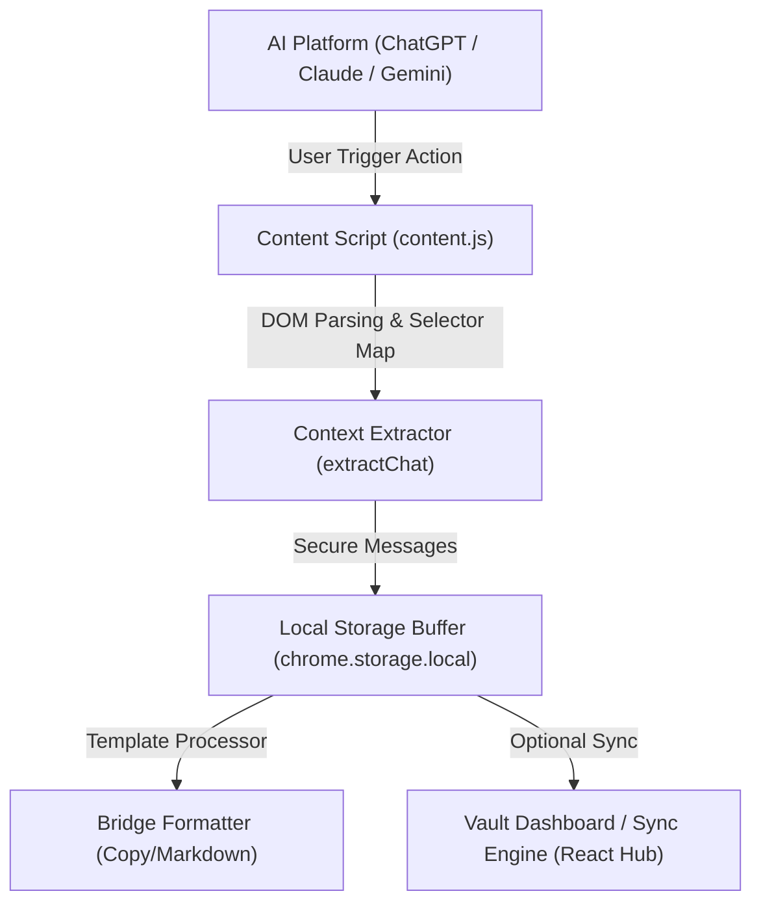

# BridgeAI — Cross-LLM Context Bridge 📡

**Sovereign intelligence orchestration for multi-LLM workflows. Extract, clean, and relay context across ChatGPT, Claude, Gemini, DeepSeek, and more with zero logic decay.**

BridgeAI is a developer-focused, local-first browser extension and dashboard designed to bridge the intelligence gap between different AI platforms. It ensures conversation continuity, reduces context loss, and accelerates engineering momentum when jumping between models.

---

## 🏛️ Core Features

* **Universal Context Extraction:** Extracts active chat logs dynamically on ChatGPT, Claude, Gemini, Perplexity, DeepSeek, Poe, and Mistral using targeted CSS selectors.
* **On-Demand Context Transfer:** Seamlessly cache conversational threads into local storage buffers and load them into a different model's text box.
* **Sovereign Formatting Templates:** Format conversation exports into structured Markdown, raw text, or JSON to build project manuals or logs.
* **Zero-Knowledge Privacy:** Extension runs strictly on user commands. BridgeAI does not monitor key logs, track browsing habits, or run background scripts.
* **Developer Tools Aesthetic:** Interactive neon dark dashboard built for power users.

---

## 🚀 Technical Architecture

The architecture uses Manifest V3 content script parsing and a secure messaging bus:



### Components
1. **Analyst Module (Extension):** Parses chat bubbles, filters metadata, and manages the local transit storage buffer.
2. **Web Portal Dashboard:** A centralized vault to review, catalog, and export historical logs (Vercel deployment).
3. **Orchestration Layer:** Relays auth tokens and vault payloads using standard browser event dispatchers.

---

## 🛠️ Installation

### Developer Build (Unpacked)
1. Clone this repository to your local system:
   ```bash
   git clone https://github.com/Ashish6312/Bridge_AI.git
   cd Bridge_AI
   ```
2. Open Chrome and navigate to `chrome://extensions`.
3. Toggle **Developer Mode** on in the top-right corner.
4. Click **Load unpacked** in the top-left corner.
5. Select the `extension/` directory within this project.
6. Click the extension icon (🧩) and pin **BridgeAI** to your active extension bar.

### Web Dashboard Dev Server
1. Install project dependencies:
   ```bash
   npm install
   ```
2. Boot the client application and backend server:
   ```bash
   npm run dev:all
   ```
3. Open your browser to [http://localhost:5173](http://localhost:5173).

---

## 🔑 Permissions Breakdown

BridgeAI is designed with the principle of least privilege. Permissions are only utilized for explicit, user-triggered commands:

* `storage`: Buffers conversation payloads temporarily in a local client-side cache (`chrome.storage.local`).
* `activeTab`: Grants temporary DOM read access to query chat threads *only* when you click "Extract".
* `scripting`: Runs clean parsing scripts inside the target AI web app tab.
* `clipboardWrite`: Powers the single-click copy buttons for Markdown/JSON summaries.
* `tabs`: Detects target LLM loads to verify if a pending context transfer is waiting to paste.
* `sidePanel`: Houses the templates and variables dashboard in a clean side panel layout.

---

## 🛡️ Privacy Commitments

* **No Automated Scraping:** We never monitor network requests or scrape data in the background.
* **Zero Keylogging:** BridgeAI does not record passwords, credit cards, or keystrokes.
* **No Selling of Data:** We do not monetize data. Cloud syncing is completely opt-in and client-encrypted.

---

## 📋 System Roadmap

- [x] Initial design system and landing pages
- [x] Content script extraction mappings (v1.0.1 Stable)
- [x] Local storage cache and context auto-paste modules
- [x] Web store compliance infrastructure (Privacy, Terms, Support portals)
- [ ] Automated distillation engine ("Prompt Core" compressor)
- [ ] Export directly to GitHub issues and markdown files
- [ ] Local desktop agent daemon integration

---

## 🛠️ Troubleshooting

### Extraction Failure
* **Cause:** AI platforms frequently rewrite their HTML templates and CSS class labels.
* **Remedy:** Click the extension icon and check the support center or verify if an update is available. Reload the page and re-run.

### Sync Failure
* **Cause:** Sync requires active auth state relaying from the dashboard.
* **Remedy:** Ensure you are logged in to the dashboard at [https://bridgeai-realworld-problem.vercel.app](https://bridgeai-realworld-problem.vercel.app).

---

## 🤝 Contributing

Contributions are welcome! Please open an issue to discuss layout updates or custom platform extractor mappings.

1. Fork the Repository.
2. Create a feature branch: `git checkout -b feature/platform-support`.
3. Commit your changes: `git commit -m 'Add Mistral AI extractor'`.
4. Push to the branch and open a Pull Request.

---

© 2026 BridgeAI Protocol. All Rights Reserved.